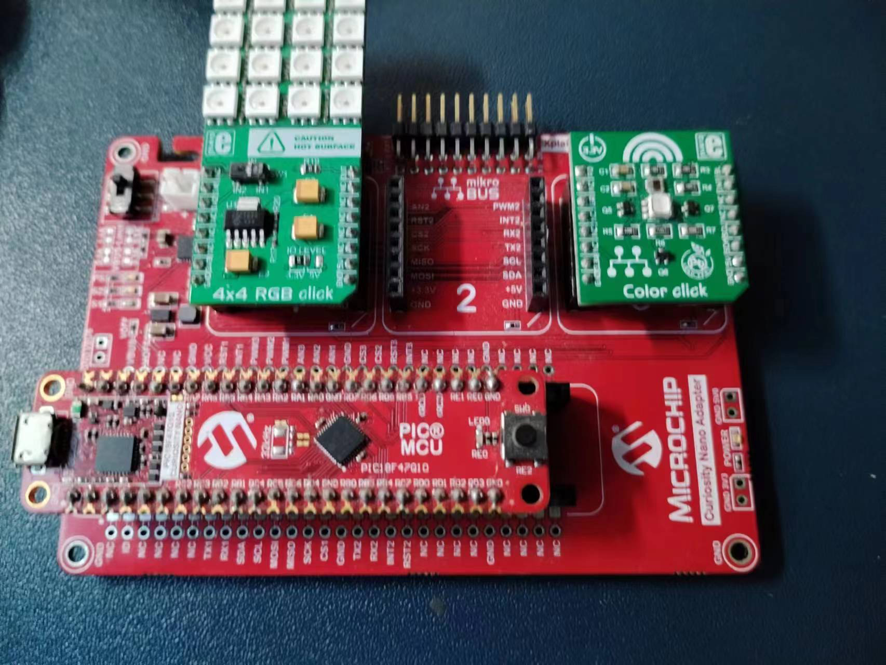
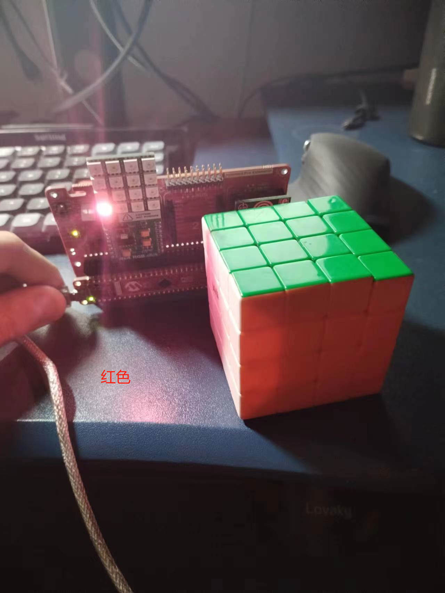

# 基于PIC18F47Q10的色彩控制

## 简介

- PIC8F47Q10作为主控
- Curiosity Nano Base for Click board
- [4*4 RGB Click](https://www.mikroe.com/4x4-rgb-click)
- [Color Click](https://www.mikroe.com/color-click)

通过Color Click感知光的颜色，触发外部中断，在RGB Click显示对应颜色，最好使用LED光源测试，而非真实物体反光

RA7-RST1-INT1 ｜ RB2-SDA-SDA | RB1-SCL-SCL | RB5-INT3-INT | RA2-AN3-RD | RD7-CS3-GR | RA5-PWM3-BL

## 开发环境

- MPLABX IDE 6.05
- XC8 2.36
- MCC 5.2.1
- windows10 macOS 13下均编译通过

## 参考代码

https://github.com/raivisr/TCS3471-Arduino-Library

https://codeload.github.com/microchip-pic-avr-examples/pic18f47q10-adcc-rgb-led-control-using-touch-sensors/zip/refs/tags/1.0.3

